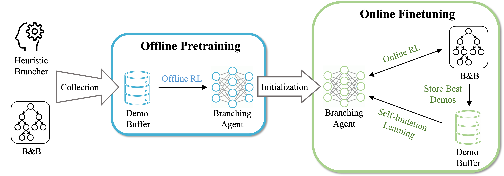

# SORREL: Suboptimal-Demonstration-Guided Reinforcement Learning for Learning to Branch



The official codebase for [SORREL: Suboptimal-Demonstration-Guided Reinforcement Learning for Learning to Branch](https://arxiv.org/pdf/2412.15534), AAAI 2025. Our implementation is based on [ecole](https://github.com/ds4dm/ecole) and [rl2branch](https://github.com/lascavana/rl2branch). If you have any question, please contact us at: shengyuf@cs.cmu.edu.


## Setup

```
conda env create -f environment.yml
conda activate SORREL
```

## Usage

There are in total 5 tasks, including `[1_set_covering, 2_independent_set, 3_combinatorial_auction, 4_facility_location, 5_multi_knapsack]`. When launching a job, specifying the benchmark through `--task_name`.

### Step 1: generate problem instances

For each task, we generate 10,000 offline pretraining instances, 200 online finetuning instances, 20 validation instances, 100 standard testing instances and 20 transfer testing instances. The following example line would save all these instances at `--instance_dir ./instances`. 

```
python 01_generate_instance.py --task_name 1_set_covering --num_offline 10000 --num_online 200 --num_valid 20 --num_standard 100 --num_transfer 20 --instance_dir ./instances
```

You could generate the instances for all taks via `scripts/generate_instance.sh`

### Step 2: generate offline pretraining dataset with a sub-optimal policy

We synthesize a sub-optimal policy, vanilla hybrid branching (VHB), by choosing full strong branching (FSB) with `--FSB_probability 0.05`, leaving the remaining decisions to pseudo-cost branching. The example below would generate 100,000 transitions for offline pretraining, using the tree MDP by adding `--tree`. To avoid the dominant samples from a single trajectory, we restrict the length of the trajectory to be `--length_limit 200`, and only keep a transition with a certain probability once the length of a trajectory reaches `--sampling_threshold 100`. The data is collected by `--num_job 20`, and saved to `--dataset_dir ./datasets`.

```
python 02_generate_dataset.py --task_name 1_set_covering --FSB_probability 0.05 --tree --instance_dir ./instances --dataset_dir ./datasets --num_samples 100000 --num_job 20 --length_limit 200 --sampling_threshold 100
```

Please see other examples in `scripts/generate_dataset.sh`

### Step 3: offline pretraining

We use TD3BC as our offline RL algorithm for pretraining, as shown in the line below. They key parameter to tune is `--alpha`, which balances the maximization of future returns (proportional to `--alpha`) and behavior cloning regularization. Besides, `--kappa` and `--gamma` decide the return function, which by default are set as `0.8` and `0.9`, respectively. Different seeds should be explored by setting `--seed`. Please see our paper for the detailed definition of these two parameters. Additional parameters are available at `common/utils/py`.

```
python 03_train_offline.py --seed 2 --model_name TD3BC --task 1_set_covering  --eval_metric Nb_nodes --batch_size 32 --epoch_size 624 --alpha 0.01 --kappa 0.8 --gamma 0.9  --time_limit 600  --patience 5 --early_stop 10 --warmup --eval_level valid --target_update_period 2 --tree  --num_job 20 --dataset_dir ./datasets --instance_dir ./instances --save_dir ./checkpoints 
```

We include our hyperparameters for other tasks in `scripts/run_TD3BC.sh`.

### Step 4: online finetuning

The command line below finetunes SORREL with PPO + Self-Imitation Learning (SIL), loading the pretrained checkpointed at `--ckpt_path`. Similarly, different seeds should be explored by setting `--seed`.

```
python 04_train_online.py --seed 4 --model_name PPO --task 1_set_covering --eval_metric Nb_nodes --batch_size 32 --epoch_size 20  --time_limit 600 --patience 10 --early_stop 20 --ckpt_path $CKPTPATH --instance_dir ./instances  --save_dir ./checkpoints --warmup --eval_level valid --tree --num_job 20
```

See other examples in `scripts/run_PPO.sh`.

### Evaluation

When evaluting a trained model, simply specifying the checkpoint path with `--ckpt_path` and test instances with `--eval_level`. For example,

```
python evaluate.py --model_name PPO --task_name 1_set_covering --eval_level test_standard --ckpt_path $CKPT_PATH --instance_dir ./instances --tree --time_limit 3600
```

We provide our checkpoints under the `./checkpoints` folder, and the corresponding evaluation scripts are at `scripts/eval_TD3BC.sh` (SORREL-offline) and `scripts/eval_PPO.sh` (SORREL).

Besides, we also provide the scripts to evaluate FSB and VHB at `scripts/eval_heuristic.sh`, and SCIP at `scripts/eval_SCIP.sh`.

To reproduce the results (# Nodes) reported in our paper, we include our standard testing instances at `instances.zip`. We do not include transfer testing instances since most instances cannot be fully solved within the time limit, making the results in # Nodes highly susceptible to the computational power of the machine. 


## Citation

If you find our work helpful, please cite our paper:
```
@inproceedings{
    feng2025sorrel,
    title={{SORREL: Suboptimal-Demonstration-Guided Reinforcement Learning for Learning to Branch},
    author={Feng, Shengyu and Yang, Yiming},
    booktitle={The 39th Annual AAAI Conference on Artificial Intelligence},
    year={2025}
    }
```